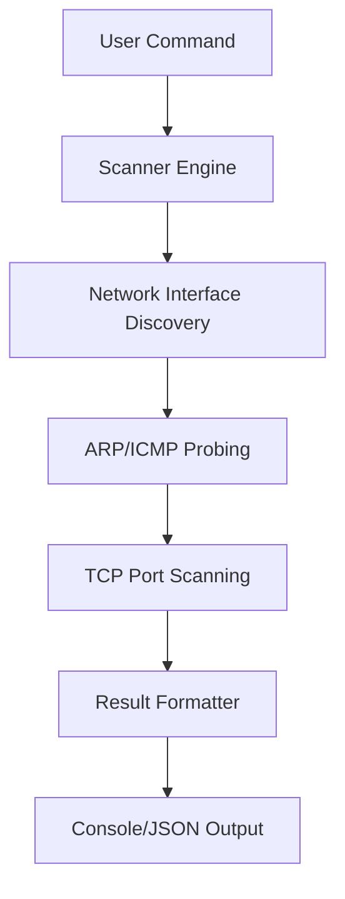

# Project Specification: NetScannerMacOS

## Project Overview
A high-performance network scanner optimized for macOS (Apple Silicon/Intel), designed to identify active hosts and open ports within a local subnet.

## Technical Stack
- **Language:** C++ (Standard 17 or higher)
- **Target OS:** macOS (Darwin)
- **Libraries:** `libpcap` (for packet capture), `std::thread` (for concurrency).
- **Build System:** CMake

## System Architecture
The application will follow a modular design:
- **Scanner Engine:** Core logic for ARP/ICMP scanning and TCP SYN probing.
- **Discovery Module:** Handles network interface detection using macOS-specific APIs.
0- **Reporter:** Formats scan results into human-readable console output or JSON.

## Data Flow (Mermaid)


## File Structure
```text
NetScannerMacOS/
├── CMakeLists.txt
├── src/
│   ├── main.cpp
│   ├── scanner.cpp
│   └── discovery.cpp
├── include/
│   ├── scanner.hpp
│   └── discovery.hpp
├── tests/
│   └── test_scanner.cpp
└── README.md
```

## Implementation Roadmap
1. **Phase 1: Setup** - Configure CMake and verify `libpcap` availability on macOS.
2. **Phase 2: Discovery** - Implement host discovery using ARP/ICMP.
3. **Phase 3: Port Scanning** - Implement asynchronous TCP port probing.
4. **Phase 4: Reporting** - Develop the output formatting module.

## Deployment Note
While designed for macOS, the logic can be ported to Linux via minor adjustments to the interface detection module.
